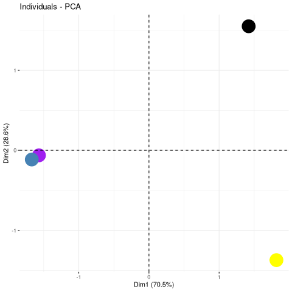

```{r theme, echo=FALSE}
xaringanthemer::style_mono_light(base_color = "#23395b")
```

```{r xaringanExtra, echo=FALSE}
xaringanExtra::use_webcam()     ## use w to turn on webcam
xaringanExtra::use_tile_view()  ## use o to get an overview
xaringanExtra::use_fit_screen() ## use Alt-F to fit to screen
xaringanExtra::use_extra_styles(
  hover_code_line = TRUE
)
```


class: middle
name: cc-by

### Get the slides at [http://bit.ly/202202uda](http://bit.ly/202202uda)

These slides are available under a **creative common
[CC-BY license](http://creativecommons.org/licenses/by/4.0/)**. You are
free to share (copy and redistribute the material in any medium or
format) and adapt (remix, transform, and build upon the material) for
any purpose, even commercially
.


---
class: middle, center, inverse

# Qu'est-ce que la bio-informatique?

???

Quand on me demande ce que je fais dans la vie professionnelle et que
je réponds de la bio-informatique, je précise toujours (et c'est
devenu un réflexe) que c'est de l'informatique appliquée aux sciences
bio-médicales. Et je dois vous avouer que ce n'est pas avec grande
conviction, car je suis bien conscient que cette définition ne soit
pas des plus instructive... mais elle a le mérite d'être courte. Si
vraiment la personne qui la pose est intéressée, il y a bien
évidemment matière à élaborer.


Pour vous, par contre, je me suis coupé en quatres car je suis parti
du principe que si vous êtes là, ce que vous voulez, en effet, savoir
**faire du sens avec un nombre incroyable de données** grâce à la
bio-informatique.

Mon but, pour aujourd'hui, est donc qu'à la fin de cette leçon, vous
ayez un idée assez claire de ce qu'est la bio-informatique.

---
class: middle

### Qu'est-ce que la bio-informatique?

- Pourquoi la bio-informatique?
- Qui fait de la bio-informatique?
- Où enseigne-t-on la bio-informatique?
- Quelques exemples d'algorithmes utilisés en bio-informatique.
- Illustration: la protéomique spatiale.

???

Pour répondre à cette question, j'ai décidé de l'aborder sous
différents angles:

- bullet points

Le temps nous étant compté, il me sera impossible de dresser un
portrait exhaustif de ce qu'est la bio-informatique. Et je ne voudrais
surtout pas vous donner une image simpliste et monotone de la
bio-informatique et des challenges auxquel elle doit de faire face. En
effet, la bio-informatique est tout aussi variée que ne l'est la
biologie, ou même les sciences bio-médicales. C'est donc par ces
différents angles (quoi, où, comment, ...)  que j'aimerais présenter
un profil varié de cette discipline et de ceux qui la pratique.


---
class: middle, center, inverse

# Pourquoi la bio-informatique?

---
class: middle

.pull-left[


]

.pull-right[


]


Credit: Wikipedia

???

Il est bon de commencer un exposé par des motivations. Tout est dans
le titre, bien évidemment:

> Comment faire du sens avec un nombre incroyable de données

Je vais donc commencer par vous présenter un partie de ces données
dont il faut faire sense. Et je vais faire cela en me basant sur ce
que l'on appelle parfois le dogme de la biologie moléculaire, qui
représent le flux (ou du moins un flux) de l'information biologique.

Mais avant cela, quelques petits rappels de biologie cellulaire. Une
cellule, l'unité du vivant, est composée d'une membrane plasmique qui
définit un contenu cellulaire, i.e. l'intérieur de la cellule, de son
extérieur. L'intérieur d'une cellule est elle-même composée sous
niches ou régions sous-cellulaire, appellées organelles. Ces
organelles ont des fonctions bien définies. Nous avons par exemple les
mitochondries, les moteurs cellulaires qui produisent de l'énergies;
l'appareil de Golgi, pour le transport et la maturation de protéines;
toute sorte de vésicules pour le transport, l'externalisation et
l'internalisation de composés ou toxines; ou encore le noyau, qui
contient l'ADN, les plans de construction des cellules.

Lorsque les cellules si divisent (lors du dévelopement d'un embyron,
ou lors le renouvellement des nos cellules ou alors le dévelopement de
cancers) l'ADN est copié et partagé entre les cellules filles, de
telle manière à ce qu'elles disposent de même patrimoine génétique en
fin de division. (Aux mutation près, bien évidemment - et le Prof
Vikkula vous en parlera sûrement lors de son exposé).

Et comment est-ce que c'est ADN est copié me demanderez vous? Grâce à
des protéines spécifique, des unités fonctionnelles, qui sont dédiées
à la copie d'ADN.

Et comment est-ce que ces protéines sont-elles produites? Grâce aux
plans de constructions contenu dans l'ADN. On ne passe néanmoins pas
directement du plan ADN vers l'unité fonctionelle protéine, on passe
par un intermédiaire, l'ARN. L'ARN est transcrit dans le noyau (c'est
le terme technique) à partir de l'ADN. Les molécules d'ARN sont
ensuite transportées en dehors du noyau pour être ensuite traduite
(c'est encore une fois le terme technique) en protéines au niveau
d'une autre niche sous-celluaire, à savoir les ribosomes.

Le flux d'information représenté ici passe donc par l'ADN (qui peut
être copié), vers de l'ARN, et finalement vers les protéines. Il
existe des voies non-canonique de rétrotranscriptions (Prof Thomas
Michiels vous en parlera probablement lors de sa leçon sur les virus)
ou voir même la copie d'ARN.

Une autre dimension, qui n'est pas reprise ici est représentée par les
métabolites, les petites molécules chimiques qui entrent en jeux dans
toutes les réactions bio-chimiques qui sont exécutées en permanence
dans nos cellules.

---
class: middle


.pull-left[

Nous avons les outils technologiques pour mesurer les molécules chaque
niveau biologique
- ADN/Génome (3e9 de paires de bases, 20000 gènes) ->
  **génomique**/**génétique**
- ARN/Transciption (50000 transcrits) -> **transcriptomique**
- Protéines/protéome (1e6 protéoformes) -> **protéomique**
- Métabolites/métabolome (1e5 métabolites) -> **métabolomique**

### **Technologies omiques**... que faire avec toutes ces données?

]

.pull-right[


]

---
class: middle

.pull-left[

Nous avons les outils technologiques pour mesurer les molécules chaque
niveau biologique
- ADN/Génome (1e9 de paires de bases, 20000 gènes) -> **génomique**
- ARN/Transciption (50000 transcrits) -> **transcriptomique**
- Protéines/protéome (1e6 protéoformes) -> **protéomique**
- Métabolites/métabolome (1e5 métabolites) -> **métabolomique**

### **Technologies omiques**... que faire avec toutes ces données ...

]

.pull-right[

### ... de la **bio-informatique**!

- Ré-assembler les données pour **comprendre** certaines facettes de
  la biologie sous-jacente.
- L'utilisation d'**algorithmes** dans les prises de décisions, par
  exemple dans la caractérisation, le traitement ou détection de
  tumeurs.

]

---
class: middle, inverse

.pull-left[

### Les algorithmes n'ont bien évidemment pas vocation à remplacer les médecins!

### Prédire n’est pas comprendre!

]

.pull-right[


]


???

Ne pas utiliser les algorithmes comme des **boîtes noires**!

---
class: middle, center, inverse

# Qui fait de la bio-informatique?

### (dans l'unité *Computational Biology and Bioinformatics* à l'institut de Duve)

---
class: middle, center
background-image: url("https://camo.githubusercontent.com/d6c09dad4c8e5eba45b8b5d727bf51429cc273dc0d90db2d80266cf259431530/68747470733a2f2f6c676174746f2e6769746875622e696f2f696d616765732f4342494f2d32303231303930382e6a7067")
background-size: contain


???

- Prof en bioinfo à l'UCLouvain et directeur du laboratoire de
  Biologie Computationelle et Bio-informatiqe à l'institut de Duve
  depuis sept 2018
- 2010 - 2018: chercher en bioinformatique à l'Université de
  Cambridge, UK
- 2006 - 2009: Bio-informaticien et gestionnaire de projet dans le
  privé.
- 2000 - 2006: Thèse de doctorat en biologie évolutive au département
  de biologie et médecine moléculaire de l'ULB. C'est la génération de
  données génomiques (donc du séquencage d'ADN) qui m'a mené à devoir
  me spécialiser en (bio)informatique pour gérer et analyser mes
  données.
- 1996 - 2000: Licence en Biologie à l'ULB

CBIO lab:

- LG: bio, these biologie évolutive, licence INFO,
- AL: bioingénieur à l'UCLouvain , thèse DDUV en épigénétique (un
  sujet dont vous parler la Prof Anabelle Decottigines), bio-info
- MM: l'UCLouvain bioingénieur, MS et thèse en statistiques,
  bio-info
- CV: MS SBIM (UCLouvain), MS Bioinfo (KULeuven), these DDUV
- PH: ingénieur (Mons), 20 ans en finances quantitatives, MS
  statistiques (UCLouvain), thèse DDUV

Cette diversité est représentative de la richesse des données
(notamment omiques) et des besoins en bio-informatique en sciences
bio-médicales.

---
class: middle, center, inverse

# Où enseigne-t-on la bio-informatique?

### (à l'UCLouvain)

---
class: middle

- Faculté de pharmacie et sciences bio-médicales (FASB, Woluwé)
- Ecole Polytechnique de Louvain (EPL, LLN)
- Ecole de biologie (LLN)
- Ecole de Statistique, Biostatistique et Sciences Actuarielles (LSBA,
  LLN)

---
class: middle, center, inverse

# bio + info ou info + bio ?

???

- bio + info or info + bio : info + bio + stats
- 2004 - 2009 (?): licence en informatique à horaire décalé à
  l'UNamur (FUNDP)

---
class: middle, center, inverse

# Comprendre la biologie à partir de données

---
class: middle, centre

.pull-left[


]

.pull-right[


]

???

- A gauche, la biolgie.
- A droite, les données.

Nouveau pathogène: insecte parasite; un virus (leçon du Prof Thomas
Michiels); une bactérie resistance aux antibiotiques (leçon du Prof
Jean-François Collet); ou alors un cancer (leçon du Prof Jean-Baptiste
Demoulin); ...

Mais la réalite ne ressemble pas à ça, mais plutôt à...

---
class: middle, center
background-image: url("figs/lego3.jpg")
background-size: contain

???

Dans la réalité complexe qu'en la biologie, il nous faut des
algorithmes pour faire sens de ces données qui sont à la fois de
grande taille, mais surtour d'une grande complexité.

---
class: middle, center
background-image: url("figs/lego3.jpg")


# Quelques exemples d'algorithmes utilisés en bio-informatique.

## (le plat de consistence)

---
class: middle, center, inverse

# Les données

---
class:middle, center

#### Echantillons


#### Données omiques


---
class:center, middle


---
class:center, middle


???

- Les détails de la construction de cette matrice quantitative
  dépendront de la technolgie omique utilisée.

- Qu'allons-nous pouvoir faire avec ces données? Pourquoi les
  collecter? Toujours, bien évidemment, dans le but d'étudier la
  biologie sous-jacente, d'inférer et de comprendre ce qu'il se
  passe. **Mieux comprendre pour mieux guérir.**

---
class: middle, center, inverse

# Les algorithmes

???

J'ai choisit de vous présenter 3 algorithmes.

- PCA
- Clustering: given some time to find the closest ones.
- Classificaton: given some time to find the class.

---
class:middle, center, inverse

## Algo 1 - Réduction de dimensions

---
class:middle, center

.pull-left[


]

.pull-right[

## 4 échantillons dans 5 dimensions

]

---
class:middle, center

.pull-left[


]

.pull-right[

## 4 échantillons dans 5 dimensions

## Comment explorer/comprendre ces données multidimensionnelles?

]

---
class:middle, center

.pull-left[


]

.pull-right[


]

---
class:middle, center

## Analyse en composantes principales (APC)

.pull-left[


]

.pull-right[



]

---
class:middle, center, inverse

## Algo 2 - clustering: qui se ressemble, s'assemble

---
class: middle

.pull-left[


]

.pull-right[

## Quels sont les échantillons qui se ressemblent le plus?

]

---
class: middle

.pull-left[


]

.pull-right[

## Quels sont les échantillons qui se ressemblent le plus?

# A votre avis?

]

---
class: middle

.pull-left[


]

.pull-right[

## Quels sont les échantillons qui se ressemblent le plus?

|      |  noir| jaune| mauve|  bleu|
|:-----|-----:|-----:|-----:|-----:|
|noir  |   0.0| 124.2| 125.7| 123.5|
|jaune | 124.2|   0.0|  35.1|  33.0|
|mauve | 125.7|  35.1|   0.0|   4.0|
|bleu  | 123.5|  33.0|   4.0|   0.0|

]

---
class: middle

.pull-left[


]

.pull-right[

## Quels sont les échantillons qui se ressemblent le plus?

|      |  noir| jaune| mauve|  bleu|
|:-----|-----:|-----:|-----:|-----:|
|noir  |   0.0| 124.2| 125.7| 123.5|
|jaune | 124.2|   0.0|  35.1|  33.0|
|mauve | 125.7|  35.1|   0.0|   4.0|
|bleu  | 123.5|  33.0|   4.0|   0.0|

]


---
class: middle

.pull-left[


]

.pull-right[


]


---
class:middle, center, inverse

## Algo 3 - classification

---
class:middle

.pull-left[


]

.pull-right[

## Nous analysons on nouvel échantillon.

]

---
class:middle

.pull-left[


]

.pull-right[


]


---
class:middle

.pull-left[


]

.pull-right[

## Est-ce que celui-ci est un *jaune*, un *vert*, un *noir* ou un *bleu*?

]

---
class:middle

.pull-left[


]

.pull-right[

## Est-ce que celui-ci est un *jaune*, un *vert*, un *noir* ou un *bleu*?

# A votre avis?

]

---
class:middle

.pull-left[


]

.pull-right[

## Est-ce que celui-ci est un *jaune*, un *vert*, un *noir* ou un *bleu*?

## Méthode des/du plus proche voisin(s): *k-NN*

]

---
class:middle

.pull-left[


]

.pull-right[

## Méthode des/du plus proche voisin(s): *k-NN*

|        |  noir| jaune| mauve|  bleu| nouveau|
|:-------|-----:|-----:|-----:|-----:|-------:|
|noir    |   0.0| 124.2| 125.7| 123.5|   124.0|
|jaune   | 124.2|   0.0|  35.1|  33.0|     8.7|
|mauve   | 125.7|  35.1|   0.0|   4.0|    32.0|
|bleu    | 123.5|  33.0|   4.0|   0.0|    30.3|
|nouveau | 124.0|   8.7|  32.0|  30.3|     0.0|

]

---
class: middle

.pull-left[

Vérification avec une APC


]

.pull-right[

Vérification avec du clustering


]

---
class: middle, center, inverse

# Illustration: protéomique spatiale

---
class: center, middle

## La protéomique spatiale


---
class: center, middle

## Les données de protéomique spatiale


---
class: center, middle

## Réduction de dimensions


---
class: center, middle

## Classification


---
class: center, middle

## Classification


---
class: center, middle

## Modélisation probabilistique


---
class: center, middle, inverse

# Bio-informatique: informatique appliquée à de la biologie/médecine.

I <svg viewBox="0 0 512 512" style="position:relative;display:inline-block;top:.1em;fill:red;height:2em;" xmlns="http://www.w3.org/2000/svg"> <path d="M462.3 62.6C407.5 15.9 326 24.3 275.7 76.2L256 96.5l-19.7-20.3C186.1 24.3 104.5 15.9 49.7 62.6c-62.8 53.6-66.1 149.8-9.9 207.9l193.5 199.8c12.5 12.9 32.8 12.9 45.3 0l193.5-199.8c56.3-58.1 53-154.3-9.8-207.9z"></path> </svg> bioinformatics

???

J'espère avoir pu vous donner une bonne idée de ce qu'est la
bio-informatique et surtout de vous avoir convaincu que de nos jours,
il est inconcevable d'imaginer une recherche de pointe en médecine
sans la bio-informatique.

---
class: middle, center

# Questions?


Slides: [http://bit.ly/202202uda](http://bit.ly/202202uda)

???

Et s'il vous reste des questions, je me ferai un plasir d'y répondre.
