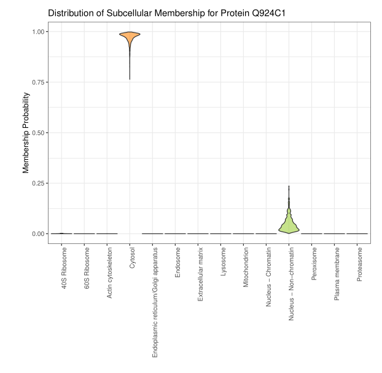

```{r theme, echo=FALSE}
xaringanthemer::style_mono_light(base_color = "#23395b")
```

```{r xaringanExtra, echo=FALSE}
xaringanExtra::use_webcam()     ## use w to turn on webcam
xaringanExtra::use_tile_view()  ## use o to get an overview
xaringanExtra::use_fit_screen() ## use Alt-F to fit to screen
xaringanExtra::use_extra_styles(
  hover_code_line = TRUE
)
```


class: middle
name: cc-by

### Get the slides at [http://bit.ly/202202uda](http://bit.ly/202202uda)

These slides are available under a **creative common
[CC-BY license](http://creativecommons.org/licenses/by/4.0/)**. You are
free to share (copy and redistribute the material in any medium or
format) and adapt (remix, transform, and build upon the material) for
any purpose, even commercially
.


---
class: middle, center, inverse

# Qu'est-ce que la bio-informatique?

---
class: middle

- Qu'est-ce que la bio-informatique?
- Pourquoi la bio-informatique?
- Qui fait de la bio-informatique?
- Où enseigne-t-on la bio-informatique?
- Quelques exemples d'algorithmes utilisés en bio-informatique.
- La protéomique spatiale.

---
class: middle, center, inverse

# Pourquoi la bio-informatique?

---
class: middle

.pull-left[


]

.pull-right[


]


Credit: Wikipedia

---
class: middle


.pull-left[

Nous avons les outils technologiques pour mesurer les molécules chaque
niveau biologique
- ADN/Génome (1e9 de paires de bases, 20000 gènes) -> **génomique**
- ARN/Transciption (50000 transcrits) -> **transcriptomique**
- Protéines/protéome (1e6 protéoformes) -> **protéomique**
- Métabolites/métabolome (1e5 métabolites) -> **métabolomique**

### **Technologies omiques**... que faire avec toutes ces données?

]

.pull-right[


]


---
class: middle


.pull-left[

Nous avons les outils technologiques pour mesurer les molécules chaque
niveau biologique
- ADN/Génome (1e9 de paires de bases, 20000 gènes) -> **génomique**
- ARN/Transciption (50000 transcrits) -> **transcriptomique**
- Protéines/protéome (1e6 protéoformes) -> **protéomique**
- Métabolites/métabolome (1e5 métabolites) -> **métabolomique**

### **Technologies omiques**... que faire avec toutes ces données ...

]

.pull-right[

### ... de la **bio-informatique**!

- Ré-assembler les données pour **comprendre** certaines facettes de
  la biologie sous-jacente.
- L'utilisation d'algorithmes dans les prises de décisions, par
  exemple dans la caractérisation ou détection de tumeurs.

]

---
class: middle, inverse

.pull-left[

### Les algorithmes n'ont bien évidemment pas vocation à remplacer les médecins!

### Prédire n’est pas comprendre!

]

.pull-right[


]


---
class: middle, center, inverse

# Qui fait de la bio-informatique?

### (dans l'unité *Computational Biology and Bioinformatics* à l'institut de Duve)

---
class: middle, center
background-image: url("https://camo.githubusercontent.com/d6c09dad4c8e5eba45b8b5d727bf51429cc273dc0d90db2d80266cf259431530/68747470733a2f2f6c676174746f2e6769746875622e696f2f696d616765732f4342494f2d32303231303930382e6a7067")
background-size: contain

---
class: middle, center, inverse

# Où enseigne-t-on la bio-informatique?

### (à l'UCLouvain)

---
class: middle

- Faculté de pharmacie et sciences bio-médicales
- Faculté des sciences
- Ecole Polytechnique de Louvain
- Ecole de statistique (statistques et sciences des données)

---
class: middle, center, inverse

# bio + info ou info + bio ?

---
class: middle, center, inverse

# Comprendre la biologie à partir de données

---
class: middle, centre

.pull-left[


]

.pull-right[


]


---
class: middle, center
background-image: url("figs/lego3.jpg")
background-size: contain


---
class: middle, center
background-image: url("figs/lego3.jpg")


# Quelques exemples d'algorithmes utilisés en bio-informatique.

## (le plat de consistence)

---
class: middle, center, inverse

# Les données

---
class:middle, center

#### Echantillons


#### Données omiques


---
class:center, middle


---
class:center, middle


---
class: middle, center, inverse

# Les algorithmes

---
class:middle, center, inverse

## Algo 1 - Réduction de dimensions

---
class:middle, center

.pull-left[


]

.pull-right[

## 4 échantillons dans 5 dimensions

]

---
class:middle, center

.pull-left[


]

.pull-right[


]

---
class:middle, center

## Analyse en composantes principales

.pull-left[


]

.pull-right[


]

---
class:middle, center, inverse

## Algo 2 - clustering: qui se ressemble, s'assemble

---

---
class:middle, center, inverse

## Algo 3 - classification

---

---
class: middle, center, inverse

# Illustration: protéomique spatiale

---
class: center, middle

## La protéomique spatiale


---
class: center, middle

## Les données de protéomique spatiale


---
class: center, middle

## Réduction de dimensions


---
class: center, middle

## Clustering


---
class: center, middle

## Classification


---
class: center, middle

## Classification


---
class: center, middle

## Modélisation probabilistique




---
class: center, middle, inverse

# Bio-informatique: informatique appliquée à de la biologie/médecine.

I <svg viewBox="0 0 512 512" style="position:relative;display:inline-block;top:.1em;fill:red;height:2em;" xmlns="http://www.w3.org/2000/svg"> <path d="M462.3 62.6C407.5 15.9 326 24.3 275.7 76.2L256 96.5l-19.7-20.3C186.1 24.3 104.5 15.9 49.7 62.6c-62.8 53.6-66.1 149.8-9.9 207.9l193.5 199.8c12.5 12.9 32.8 12.9 45.3 0l193.5-199.8c56.3-58.1 53-154.3-9.8-207.9z"></path> </svg> bioinformatics

---
class: middle, center, inverse

# Questions?
